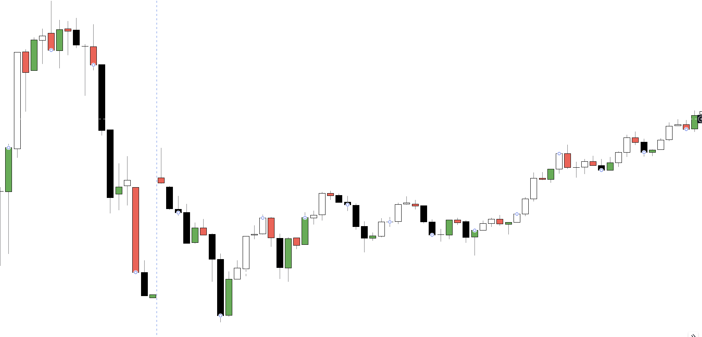

#### Problem statement

- Simple Reversal bar
     - Previous bar is opposite bar body, so current bar is Reversal bar
        - If Doji, then use the bar before Doji as base (Doji = 0 body)
        - End Result = Color the Reversal Bar chosen Color for BL and BR

#### Code
```
//@version=5
indicator("Simple Reversal Bar", overlay = true)

// this bar
isCurBl = close > open
isCurBr = close < open
isCurDj = close == open

// previous bar
Precision = input.float(0.01, minval=0.0001, title="Precision")
isPrevDoji = math.abs(open[1] - close[1]) <= (high[1] - low[1]) * Precision
// isPrevDj = close[1] == open[1]
isPrevBl = isPrevDoji ? close[2] > open[2]: close[1] > open[1]
isPrevBr = isPrevDoji ? close[2] < open[2]: close[1] < open[1]
// this bar is reversal ?
isCurBlRv = isCurBl and isPrevBr
isCurBrRv = isCurBr and isPrevBl

// plot
plotcandle(open, high, low, close, title='Strong Bull Reversal', color = isCurBlRv ?  color.green : na)
plotcandle(open, high, low, close, title='Strong Bear Reversal', color = isCurBrRv ?  color.red : na)


isDoji = math.abs(open - close) <= (high - low) * Precision

plotchar(isDoji, "isDoji", "X", location.top, color = color.black)

```

#### Sample Output
