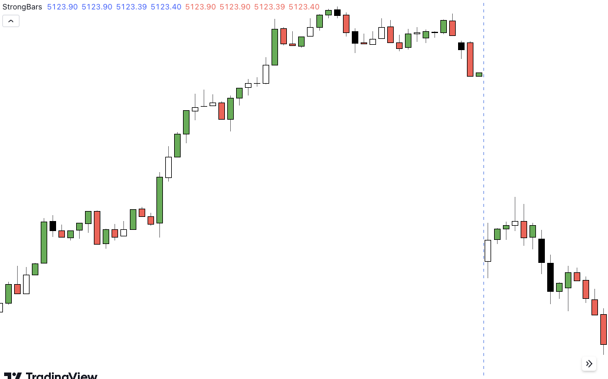

#### Problem statement
- IBS (Intra bar strength = (C-L)/H-L*100)
- Strong BL > 75  %
- Strong BR < 25%
- Color the bar -
- See below image - 


#### Code
```
//@version=5
indicator("StrongBars", overlay = true)
ibs = (close - low) / (high - low) * 100

strongBL = ibs > 75
strongBR = ibs < 25

plotcandle(open, high, low, close, title='Strong Bull', color = strongBL ?  color.green : na)
plotcandle(open, high, low, close, title='Strong Bear', color = strongBR ?  color.red : na)

```

#### Sample Result
